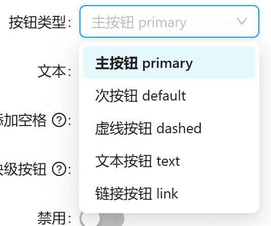

## 文本输入框


```
{
    name: 'text',
    label: '文本',
    type: 'input',
},
```

## 下拉选择器



```
{
    name: 'type',
    label: '按钮类型',
    type: 'select',
    options: [
        { label: '主按钮 primary', value: 'primary' },
        { label: '次按钮 default', value: 'default' },
        { label: '虚线按钮 dashed', value: 'dashed' },
        { label: '文本按钮 text', value: 'text' },
        { label: '链接按钮 link', value: 'link' },
    ],
},
```

## switch 选择


```
{
    name: 'autoInsertSpace',
    label: '添加空格',
    type: 'switch',
    prompt: '两个汉字之间默认显示一个空格',
},
```

## 分段控制器


```
{
    name: 'iconPosition',
    label: '图标位置',
    type: 'segmented',
    options: [
        {
            label: '左',
            value: 'start',
        },
        {
            label: '右',
            value: 'end',
        },
    ],
},
```

## Icon上传


```
{
    name: 'icon',
    label: '图标',
    type: 'selectIcon',
},
```
